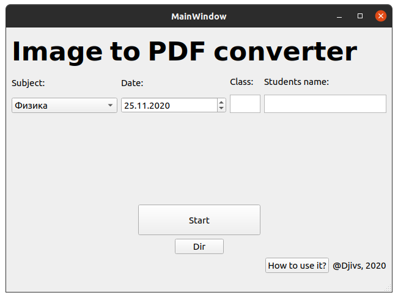

# img-to-pdf

Simple and useful tool for converting multiple images in 1 pdf

Firstly developed for distance learning homework files creating

### Supported Platforms:

- Windows
- Linux

### Installation guide

##### Linux:

1. Install xinerama library:

   `sudo apt-get install -y libxcb-xinerama0`

2. Go to [Releases](https://github.com/Djivs/img-to-pdf/releases) page and download Linux archive

3. Go to folder with your archive and extract it
4. Go to extracted folder
5. Make img-to-pdf.sh executable
6. Run img-to-pdf.sh

##### Windows:

1. Go to [Releases](https://github.com/Djivs/img-to-pdf/releases) page and download Windows installer
2. Run the installer, follow installer instructions and install programm
3. Run programm

### How to use it

##### Note: Every field is auto-savig, so you don't have to enter data multiple times

- Put all your images to one folder

- Choose this directory by hitting "Dir" button

- Enter your class and name in text edit fields

- Choose subject of your homework via combo box

- Choose date of your work via date edit

- Hit "Start" button

  Your PDF will be saved in chosen directory. 
